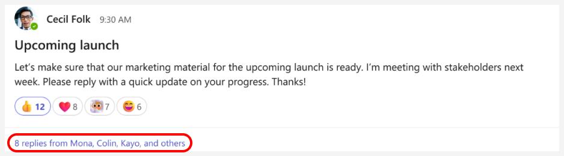

# Summarize chat and channel threads using Copilot in Teams
---
Possessing proficiency in Copilot for Teams is a pivotal skill for executives seeking to streamline collaboration and drive actionable outcomes in their teams. In the fast-paced world of business communication, sifting through chat and channel threads to distill key action items is a time-consuming task. Copilot for Teams revolutionizes this process by intelligently analyzing conversations and generating a concise list of action items.

Executives who harness this capability not only save valuable time but also ensure that critical tasks are identified and addressed promptly. This skill not only enhances productivity within the team but also reinforces effective leadership, enabling executives to stay ahead of priorities and foster a culture of efficiency. Copilot for Teams, as a collaborative assistant, becomes an invaluable asset for executives striving to lead teams toward tangible results in the ever-evolving landscape of modern business.

### Exercise

When using Copilot in Teams to examine the details of a specific chat or channel, Copilot can provide a list of predefined, commonly used prompts to select from. Choosing a prompt from this list saves you from having to manually type it in. It also provides suggestions on other prompts that you can use when working in a chat or channel.

In the **Copilot** pane, when you select the **More prompts** option, Copilot displays a drop-down menu containing the predefined prompts. There are two types of predefined prompts that are available:

 -  Time-bound prompts, such as:
     -  Highlights from the past day
     -  Highlights from the past 7 days
     -  Highlights from the past 30 days

 -  Non-time-bound prompts, such as:
     -  What decisions were made?
     -  What are the open items?
     -  Highlights from this conversation (Teams' Channel)
     -  Recap the meeting (Teams' Chat)

> **IMPORTANT:** The predefined prompts that Copilot displays can vary depending on the content that's available in the selected chat or channel.

Copilot in Teams uses the following guidelines to determine which prompts to display for a given chat or channel:

 -  Copilot includes the "Recap the meeting" prompt for 24 hours after a meeting transcript is made available in the chat.
 -  Copilot only includes the time-bound prompts ("Highlights from the past...") and non-time-bound prompts ("decisions/open items") if there's enough content in the time frame to warrant them.
 -  Copilot doesn't display any prompts for a chat if there isn't enough content in the past day. In this case, Copilot displays the following message when you select **More prompts**: *You'll be able to use prompts when there's new content in the chat. In the meantime, Copilot can still answer your questions.*

> **NOTE:** If a chat or channel doesn't have enough content to even warrant the use of Copilot, then the Copilot icon won't appear when you select the chat or channel.

#### Use Copilot in a Teams chat

As an executive for your organization, you want to use Copilot in Microsoft Teams chat and channels to help you quickly get up to speed on conversations. In this exercise, you want Copilot to summarize the key points from the past 30 days for a specific chat. You begin by using one of Copilot's predefined prompts to gather this information. From there, you type a series of prompts to delve deeper into the results.

1.  Select **Chat** from the navigation bar on the left side of **Teams**, and then select a chat that's of specific interest to you. For this first task, select a chat that you know extended across multiple days - perhaps a chat from a reoccurring meeting.
2.  Select the **Open Copilot** icon in the upper-right corner of the chat.
    
   
    
    
   > **NOTE:** The Copilot icon appears in a one-on-one chat, group chat, and meeting chat.
3.  At the bottom of the **Copilot** pane that appears, under the prompt field, select **More prompts**. In the drop-down menu that appears, select **Highlights from the past 30 days**. If this predefined prompt doesn't appear in the drop-down menu, enter the following prompt instead:
    
    **Summarize this chat**.
4.  In the Copilot response, note how Copilot includes a footnoted number at the end of each statement. Each footnote provides a direct link to the highlighted statement. Select one of the footnotes for a highlighted item. When you do so, note how Copilot scrolls directly to that message in the chat thread. This feature enables you to quickly navigate to a specific highlight without having to manually scroll through the thread searching for it. Repeat this step for a couple of the highlighted items to see how valuable this feature is.
5.  You may often find yourself interested in what a certain person said in a chat thread. Enter the following prompt (replace "name of the person" with the person's name) and select the **Send** icon:
    
    **What did \{name of the person\} say?**
6.  Once Copilot generates a response, select the footnote for a particular item to scroll directly to that message. Note how this feature quickly allows you to zero in on a particular response from that person.
7.  In the **Chat** pane, select the chat for another meeting that you feel has significant messages. Note how the **Copilot** pane disappears. The Copilot pane only appears for a chat when you select the Copilot icon in the upper-right corner of the Chat window. Select the **Copilot** icon for this chat.
8.  At the bottom of the **Copilot** pane that appears, under the prompt field, select **More prompts**. In the drop-down menu that appears, select **What decisions were made** ? If this prompt doesn't appear, manually enter this prompt and select the **Send** icon.
9.  Review the decisions that were made. Select a footnote for a particular item to scroll directly to that decision.
10. Select **More prompts**. In the drop-down menu that appears, select **What are the open items**? If this prompt doesn't appear, manually enter this prompt and select the **Send** icon.
11. Review the decisions that were made. Select a footnote for a particular item to scroll directly to that open item.
12. You now want to use Copilot in Microsoft Teams chat to help you quickly get up to speed on a particular conversation. To do so, you plan to use one of Copilot's predefined prompts to provide a recap of the meeting. With that information in hand, you plan to type a series of prompts to delve deeper into the results. To begin, locate a particular chat thread that's of interest to you and then select the chat to open it.
13. With the chat thread open, select the **Open Copilot** icon in the upper-right corner of the chat. 
14. At the bottom of the **Copilot** pane that appears, under the prompt field, select **More prompts**. In the drop-down menu that appears, select **Recap the meeting**. If this predefined prompt doesn't appear in the drop-down menu, manually enter this prompt and then select the **Send** icon.
15. If you recall from the prior Teams' Chat exercise, the **Highlights from the past** prompts provided footnoted numbers at the end of each statement. These footnotes allowed you to scroll directly to each highlighted statement in the chat. However, in this chat, note how the **Recap the meeting** prompt doesn't provide footnoted responses. That's one of the main differences between a predefined time-bound prompt and a predefined non-time-bound prompt.
16. In the prior step, you selected the predefined **Recap the meeting** prompt. To get a better feel for how different types of prompts can provide different results, enter the following prompt, which is fairly synonymous to the **Recap the meeting** prompt, and then select the **Send** icon:
    
**Summarize the meeting**
17. Compare the results that you received from the predefined **Recap the meeting** prompt with the results from the non-predefined **Summarize the meeting** prompt. Note the differences generated in each response.
18. In the previous chat that you worked on, you selected the predefined prompts that asked Copilot in Teams **"What decisions were made?"** and **"What are the open items?"** Instead of submitting those same predefined prompts again, let's try something different. This time, enter the following prompt and select the **Send** icon:
    
**Did anyone appear upset at the meeting?**
19. Note Copilot's response. Keep this response in mind as you write prompts in the future. As an AI tool, there are certain limitations to Copilot's abilities.

#### Use Copilot in a Teams channel

Copilot in a Teams channel works similar to Copilot in a Teams chat.

1.  Select **Teams** from the navigation bar on the left side of **Teams**, and then select a specific channel within a team.
2.  Within the channel discussion, select the link below the channel post to expand the replies and see the full conversation.
    
   
    
3.  From this immersive channel post view, select the **Open channel copilot** icon in the upper-right corner of the channel view.
    
   
    
4.  At the bottom of the **Copilot** pane that appears, under the prompt field, select **More prompts**. In the drop-down menu that appears, select **Highlights from this conversation**. If this prompt doesn't appear, manually enter this prompt, and select the **Send** icon.
5.  Repeat this process by selecting any of the other predefined prompts that appear or enter your own prompts. Note how footnotes appear in the Copilot responses, just as they did in the chats that you selected earlier.
