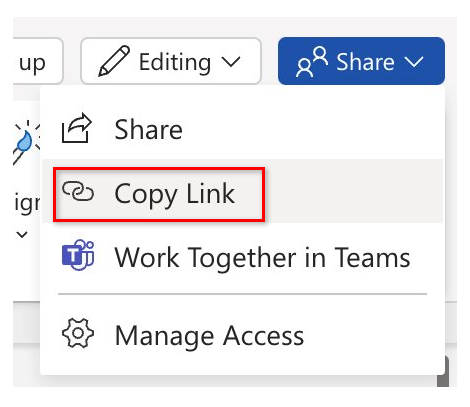
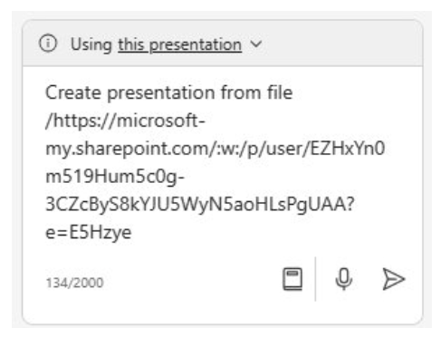

# Create a slide presentation using Copilot in PowerPoint
---
Proficiency in using Copilot for PowerPoint is a strategic skill for executives aiming to elevate the impact of their presentations. In the corporate world, effective communication through compelling slide decks is paramount. Copilot for PowerPoint serves as an intelligent collaborator, offering real-time suggestions and enhancements as executives craft their presentations. This tool not only accelerates the creation process but also ensures that the content is engaging, clear, and resonant with the intended audience.

Executives who become proficient in Copilot for PowerPoint gain a competitive edge by effortlessly refining their messaging, enhancing visual appeal, and maintaining a professional standard. This skill not only saves time but also positions executives to deliver presentations that leave a lasting impression, fostering effective communication, and bolstering leadership influence in the dynamic landscape of business interactions.

With Copilot in PowerPoint, you can create a presentation from an existing Word document. When you provide Copilot in PowerPoint with the link to your Word document, it can generate slides, apply layouts, and choose a theme for you.

### Exercise

As the CFO at Fabrikam, Inc., an IT services firm located in Minneapolis, MN, you're meeting next week with the company's major shareholders to provide a presentation on the company's 2023 year-end financial performance. Your VP of Accounting provided you with a summary of the company's Income Statement.

In the prior exercise, you used Copilot in Word to write your speech to the shareholders based on the Income Statement. In this exercise, you plan to use Copilot in PowerPoint to create a slide presentation based on your speech. To do so, you must begin by copying the link to the **Fabrikam 2023 Financial presentation.docx** file that you created in the prior exercise.

In the prior exercise, you accessed the company's Income Statement in Copilot by accessing the file from the Most Recently Used (MRU) file list. In this exercise, you're going to gain experience accessing a file using a different process. Instead of using the MRU list, you plan to access the speech by copying its file path into Copilot through the **Share** option in Word. Perform the following steps to have Copilot in PowerPoint create a draft of your presentation:

1.  If you have a Microsoft 365 tab open in your Edge browser, then select it now; otherwise, open a new tab and enter the following URL: **https://www.office.com**
2.  On the **Microsoft 365** navigation pane, select **Word** to open the Word file page.
3.  On the file page in **Word**, scroll down to the list of recent files and select **Fabrikam 2023 Financial presentation.docx** to open it in a new tab in your Microsoft Edge browser.
4.  Copy the URL of the document by selecting the **Share** button in the upper-right corner, above the ribbon and selecting **Copy Link** from the drop-down menu that appears.
    
    
    
    
     > **TIP:** Copilot can occasionally have trouble using the URL from your address bar. Copy the link from the **Share** tray for best results.

5.  Close the **Link copied** dialog box that appears in Word.
6.  Close this document tab in your Microsoft Edge browser. This return you to the **Word \| Microsoft 365** tab.
7.  On the Word file page, select the **PowerPoint** icon in the navigation pane on the left.
8.  In **PowerPoint**, open a new blank presentation.
9.  Select the **Copilot** option on the right side of the ribbon.
10. In the **Copilot** pane that appears, several predefined prompts are available for you to choose from. Select the **Create presentation from file** prompt.
11. In the prior exercise, you linked a file into a prompt by selecting the file from the MRU list. In this exercise, we want you to gain experience linking a file into a prompt using another method. Above the prompt field at the bottom of the **Copilot** pane, a **Suggestions** window appears that contains the three most recently used files. Normally, you would select your desired file if it appeared in this window. However, in this training exercise, even if the **Fabrikam 2023 Financial presentation.docx** appears in the MRU list, let's assume that it didn't. As such, you must paste the link to the file into the prompt field.
    
    In the prompt field, Copilot automatically types in **Create presentation from file /**. Place your cursor after the forward slash and enter **Ctrl+V** to paste the link to this document into the prompt.
    
 
    
12. Select the **Send** icon.
13. This prompt triggers Copilot to create a slide presentation based on the document. In doing so, it displays the outline of the presentation and a list of features included in the presentation. These features may include speaker notes, images, layouts to organize slides, and a General sensitivity label.
14. You're now free to review the slides and make any necessary updates. You can use the **Designer** tool to adjust the layouts.
15. As you review the slides, be on the lookout for references to "the speaker" or any other items that you may need to change. For example, in the test run of this exercise, PowerPoint created an Introduction slide that included the following text:
    
    **The speaker introduces a presentation on Fabrikam's 2023 income statement highlights, reporting strong performance and growth despite challenges from the global pandemic and competitive market. The presentation will summarize the main results and explain how they align with the company's strategic vision and goals**.
    
    Note the reference to "The speaker" along with the second sentence that begins with "The presentation will summarize...". These examples are instances of text that you should be on the lookout for in presentations created by Copilot. You should remove these types of references as they're more applicable as speaker notes rather than text intended for audiences.
16. Review the speaker notes that Copilot added to the presentation. Verify they call out the points that you want to make during the presentation.
17. Try using Copilot to update the presentation. For example, enter the following prompt:
    
    **Add a new slide after slide 1. This slide should have an image of a mountain peak in the Alps. Towards the bottom of the slide, add a text box that says: Fabrikam's company motto - "We overcome every obstacle." Add speaker notes to this new slide that talk about how Fabrikam works diligently to solve every customer's request, never letting any obstacle stand in its way of success**.
18. Review the new slide that was created. How successful was Copilot in creating this slide?
19. While the remaining training exercises in this module don't use this presentation, you can either discard it or save it if you want for future reference.
