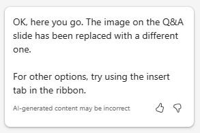
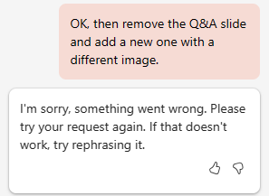
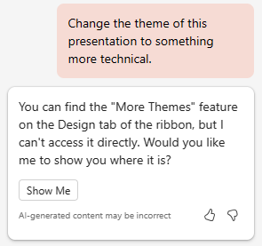

# Create a project plan presentation using Copilot in PowerPoint
---
Proficiency in using Copilot for PowerPoint is a strategic skill for IT professionals aiming to elevate the impact of their presentations. In the corporate world, effective communication through compelling slide decks is paramount. Copilot for PowerPoint serves as an intelligent collaborator, offering real-time suggestions and enhancements as IT professionals craft their presentations. This tool not only accelerates the creation process but also ensures that the content is engaging, clear, and resonant with the intended audience.

IT professionals may need to create PowerPoint presentations for various reasons. For instance, they may need to:

 -  Present their ideas or proposals to their team or management.
 -  Train new employees or demonstrate new software or hardware to clients.
 -  Explain complex technical concepts to nontechnical audiences, such as stakeholders or investors.
 -  Showcase their work or promote their services to potential clients.

With Copilot in PowerPoint, you can create a presentation from an existing Word document. When you provide Copilot in PowerPoint with the link to your Word document, it can generate slides, apply layouts, and choose a theme for you.

In the prior exercise, you created a project plan to install a network security product. You then asked Copilot to analyze a product specification report for the network security product and update the project plan with information from the product spec report.

In this exercise, you use Copilot in PowerPoint to create a slide presentation based on the project plan. You want to use this presentation to explain the project plan to your IT staff, and ultimately to corporate management.

### Exercise

As the Director of IT at Adatum Corporation, you plan to install the Contoso CipherGuard Sentinel X7 network security product into Adatum's corporate network. In the prior exercise, you used Microsoft Copilot to create an installation project plan. You now want to use Copilot in PowerPoint to create a slide presentation based on that plan. You must present the project plan to your IT staff, and eventually to corporate management. Perform the following steps to create the slide deck that you plan to use in your presentation.

1.  If you completed the prior exercise and created a **Contoso CipherGuard project plan.docx** file, then ensure that you copied it to your OneDrive account and proceed to the next step. However, if you were unable to create this project plan in the prior exercise, then select the following link to download a [Contoso CipherGuard project plan](https://edxinteractivepage.blob.core.windows.net/ms-4004/Contoso%20CipherGuard%20project%20plan.docx) that was created for you. Once the file finishes downloading, copy it to your OneDrive account.
2.  At this point, you should have a **Contoso CipherGuard project plan.docx** file stored in your OneDrive account. Open the file to verify that everything is in order, and then close the file. Doing so also ensures that it appears in the Most Recently Used (MRU) file list.
3.  If you have a Microsoft 365 tab open in your Microsoft Edge browser, then select it now; otherwise, open a new tab and enter the following URL: **https://www.office.com**
4.  On the **Microsoft 365** home page, select the **PowerPoint** icon in the navigation pane on the left.
5.  In **PowerPoint**, open a new blank presentation.
6.  Select the **Copilot** option on the right side of the ribbon.
7.  In the **Copilot** pane that appears, several predefined prompts are available for you to choose from. Select the **Create presentation from file** prompt.
8.  In the prompt field at the bottom of the **Copilot** pane, Copilot automatically enters the text: **Create presentation from file /**.The forward slash is the universal Copilot indicator to enter a link to a file. In this case, it triggers Copilot to open a **Suggestions** window that displays three of the most recently used files.
     -  If your file appears here, then select it now and proceed to the next step.
     -  If the file isn't one of the three being displayed, select the right arrow (**&gt;**) in the upper right corner of the **Suggestions** window to see an expanded MRU file list. If the file appears here, then select it now and proceed to the next step.
     -  If you don't see your file in the expanded MRU list, then you must copy the link to the report and paste it in the prompt field. To do so:
        1.  Select the **Microsoft 365** browser tab and select **Word** in the navigation pane.
        2.  In the **Word** home page, in the list of recent files, select the report to open it in Word.
        3.  In the report in Word, on the far-right above the ribbon, select the **Share** button. In the drop-down menu that appears, select **Copy Link**. Wait for the **Link copied** window to appear, which is your assurance that the link to the file is copied to your clipboard.
        4.  Switch to your **PowerPoint** tab, and at the bottom of the **Copilot** pane, the prompt field should still be displaying **Create presentation from file /**. Position your cursor after the forward slash (**/**) and then paste in (**Ctrl+V**) the link to the report.
9.  Note how the file appears in the prompt field. Select the **Send** icon in the prompt field.
10. This prompt triggered Copilot to create a slide presentation based on the document. In doing so, it first displayed the outline of the presentation. Then it displayed a separate window showing a bulleted list of some of the changes that it made to the presentation based on the document.
11. You're now free to review the slides and make any necessary updates. Pay special attention to the changes the Copilot made based on the document. You can use the **Designer** tool to adjust the layouts.
12. Review the speaker notes that Copilot added to the presentation. Verify they call out the points that you want to make during the presentation.
13. You notice that there isn't a slide at the end for a Question and Answer (Q&A) session. To correct this oversight, enter the following prompt:
    
    **Add a Q&A slide at the very end of the presentation with an appropriate image**.
14. Review the new slide that was created. You don't like the image that Copilot used for this slide, so enter the following prompt asking Copilot to change the image:
    
    **I don't like the image you used on the Q&A slide. Please replace it with a different image**.
15. What response did you receive? In our testing of this exercise, sometimes Copilot didn't replace the image and it returned the following message.
    
    
     
   Other times during testing, this prompt worked and Copilot replaced the image on the slide and returned the following message.
     
   
     
    > [!TIP]
    > Remember that Copilot is still a work in progress, so some features are still being perfected. As a best practice, if Copilot is unable to complete your request, then try it again. And if it still doesn't work, then try rephrasing your request or splitting it into two.

16. Even if Copilot worked and replaced your image, let's assume for the sake of this training exercise that it didn't. In this case, let's ask Copilot to not just replace the image, but to remove the old slide and replace it with an entirely new slide containing a different image. As such, enter the following prompt:
    
    **Please remove the Q&A slide and add a new one with a different image**.
17. What response did you receive? In our testing of this exercise, Copilot continuously removed the Q&A slide but it didn't create a new one in its place. Instead, it kept returning the following message.
    
   
    
    
  How did Copilot respond when you tried this prompt?
      
-  Did Copilot remove the old slide and create a new one with a different image, just as you asked? If so, congratulations!
-  Or did it remove the old slide but not create a new one? If so, ask it to create a new Q&A slide with an image.
-  Or did it do nothing at all? If so, then try breaking this final prior prompt into two - first ask it to remove the Q&A slide, and then submit a second prompt asking it to create a new Q&A slide with an image.
    
      > [!TIP]
      > If Copilot didn't do as you asked or if it returned an error, then this scenario is a good example of keeping prompts as simple as possible. Follow Copilot's suggestion by rephrasing your request. It's best to ask Copilot to do one task at a time, such as first removing the old slide, and then submitting a second request to add a new slide with an image (in our testing, Copilot always used a different image with each request).
18. Regardless how the last few steps went in dealing with the Q&A slide, you decide to move forward and try one last thing. In reviewing the presentation, you decide that you want to change the theme of the presentation to something more appropriate due to the technical nature of the topic. Enter the following prompt:
    
 **Change the theme of this presentation to something more technical.**
19. Note Copilot's response.
    
   
    
    
This scenario is one of those times when it's important to remember the prompting best practice: **Understand Copilot's limitations**. In this case, it isn't an understanding of a limitation as much as it's an understanding as to how Copilot works. In this case, Copilot points you to an existing PowerPoint feature rather than duplicating what that feature does.

20. While the remaining training exercises in this module don't use this presentation, you can either discard it or save it if you want it for future reference.
