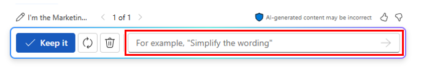

# Consolidate multiple marketing reports using Microsoft 365 Copilot in Word
---
Microsoft 365 Copilot in Word is an AI-powered writing assistant that can help Marketing professionals create documents more efficiently. In a document with existing content, Copilot can help you transform the content. It can rewrite selected content, or even transform selected content into a table. Microsoft 365 Copilot in Word can help Marketing professionals save time and effort when creating documents. It can help you generate content, rewrite text, and provide helpful suggestions. With its AI-powered writing assistance, Copilot can help you create documents more efficiently and effectively.

Microsoft 365 Copilot in Word can help Marketing professionals in various ways, such as:

 -  **Creating engaging content**. Microsoft 365 Copilot in Word can assist marketing professionals in creating engaging content for their blog and social media.
 -  **Analyzing customer feedback**. Microsoft 365 Copilot in Word can help marketing professionals analyze customer feedback and engagement data to identify trends and insights. They can use this information to tailor future marketing strategies, resulting in increased online engagement and customer reach.
 -  **Generating marketing reports**. Microsoft 365 Copilot in Word can help marketing professionals generate reports on their marketing campaigns, including data on customer engagement, conversion rates, and return on investment (ROI).
 -  **Optimizing email communication**. Microsoft 365 Copilot in Word can assist marketing professionals in refining their email responses and strategizing customer engagement tactics, ensuring prompt and effective communication.
 -  **Preparing meeting agendas**. Microsoft 365 Copilot in Word can help marketing professionals prepare meeting agendas, ensuring that all important topics are covered and that meetings are productive, and outcome driven.

In this exercise, you use Microsoft 365 Copilot in Word to create a single report by combining three separate reports into one. You then use Copilot to modify the report with additional information.

When you use Microsoft 365 Copilot in Word to generate a new document, it creates a draft of the document. If you request that Copilot add or change something in the document, it regenerates a new draft of the document with the changes applied. You continue working in Copilot draft mode, where Copilot makes all the requested changes for you. Once you're satisfied with the latest draft, you select the **Keep it** button. Doing so changes the document from a Copilot draft to a Word document. Should you try to manually change anything when you're in draft mode, the Copilot window disappears. While you can select the Copilot icon on the Word ribbon to open the Copilot pane, the **Regenerate** option isn't available, since you're no longer working in Copilot draft mode.

### Exercise

As the Latin America (LATAM) Marketing Director for Contoso Beverage, a division of Contoso, Ltd., your product manager provided you with three separate reports involving the company's Mystic Spice Premium Chai Tea beverage. However, you’re finding it difficult to analyze the information, since you’re constantly jumping back and forth between documents.

You decide to use Microsoft 365 Copilot in Word to combine the reports into a single LATAM Market Analysis report for Mystic Spice Premium Chai Tea. Once Copilot creates this report, you want to review it and possibly update it with other information that Copilot can find on the Chai Tea market in Latin America.

Perform the following steps to create this market analysis report using Microsoft 365 Copilot in Word:

1.  Select the following link to download a copy of [Mystic Spice Premium Chai Tea product description](https://go.microsoft.com/fwlink/?linkid=2268929).
2.  Select the following link to download a copy of [Contoso Chai Tea market trends 2023](https://go.microsoft.com/fwlink/?linkid=2269122).
3.  Select the following link to download a copy of [Promotion Plan for Chai Tea in Latin America](https://go.microsoft.com/fwlink/?linkid=2269126).
4.  Once the download is complete, open **File Explorer** and move the files from your **Downloads** folder to a folder in your OneDrive account.
5.  In this exercise, you access the documents from the Most Recently Used (MRU) file list. To get the files to appear in the MRU list, open and close each of the three files in your OneDrive account.
6.  In **Microsoft 365**, open **Microsoft Word**, and then open a new blank document.
7.  In the **Draft with Copilot** window that appears at the top of the blank document, enter the following prompt, but don't select the **Generate** button until after you link the three files to the prompt:
    
    **I'm the LATAM Marketing Director for Contoso Beverage. Please create a LATAM Market Analysis report for our Mystic Spice Premium Chai Tea beverage. Combine the three attached files to create a report that describes the product, analyzes the market trend for it, and includes a promotion plan for Latin America**.
8.  You now must attach the three documents to the prompt. In the **Draft with Copilot** window, select the **Reference your content** button. In the drop-down menu that appears, if the **Mystic Spice Premium Chai Tea product description.docx** file appears in the list of files, select it. Otherwise, select **Browse files from cloud**, select the file from the **Recent** file list, and then select the **Attach** button. Note how the file is displayed in the prompt.
9.  Repeat the prior step for both the **Contoso Chai Tea market trends 2023.xlsx** file and the **Promotion Plan for Chai Tea in Latin America.docx** file. At this point, links to all three files should appear in the prompt.
10. Select **Generate**. Upon doing so, Copilot extracts the pertinent information from the three files and drafts a report that combines them into a single Market Analysis report for Mystic Spice Premium Chai Tea.
11. After reviewing this first draft of the Market Analysis report, you recognize that it's missing some critical information. You would like to see it include a section titled **Competitive Analysis**. You want Copilot to analyze the competition. To do so, enter the following prompt in the Copilot window at the bottom of the report and then select the **Generate** arrow:
    
    
    
    
    **This report looks good. However, please add a section titled Competitive Analysis. Review the beverage companies in Latin America that sell Chai Tea and then provide information in this section on the strengths and weaknesses of these competitors, their market share, and their pricing strategies**.
12. After reviewing this second draft of the report that contains the new Competitive Analysis section, you realize that one last thing is missing. You want Copilot to add a section on **Distribution Channels**. This section should analyze the distribution channels used to sell Chai Tea in Latin America. To do so, enter the following prompt in the Copilot window at the bottom of the report and then select the **Generate** arrow:
    
    **Nice job! One last thing. Please add a section titled Distribution Channels. Review the distribution channels used to sell Chai Tea in Latin America and then provide information in this section on the types of retailers, wholesalers, and distributors used**.
13. After reviewing this latest draft that contains the new Distribution Channels section, you're satisfied with the report and you're ready to save it. In the Copilot window at the bottom of the document, select the **Keep it** button to convert it from a Copilot draft to a Word document.
14. Review the document. If you want to make any manual changes, you can do so now. Once you're satisfied with it, feel free to save the document to your OneDrive if you wish to keep it for future reference, or just discard it.
15. Close this tab in your Microsoft Edge browser.
