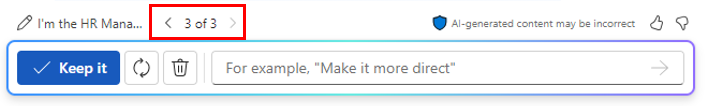

# Create a job description using Microsoft 365 Copilot in Word
---
Microsoft 365 Copilot in Word is an AI-powered writing assistant that can help HR professionals streamline their work processes and improve their productivity. Copilot can assist HR professionals in various ways, including automated resume screening, job description assistance, efficient onboarding, employee feedback analysis, and more.

For example, Copilot can automate the initial stages of the resume screening process, helping HR professionals quickly identify the most suitable candidates from large pools of applicants. Copilot can also simplify the handling of onboarding documents, from contract generation to policy dissemination, making the onboarding process more efficient. Plus, it can help create customized onboarding plans for new hires, ensuring they feel welcome and well-informed from day one.

Microsoft 365 Copilot in Word can also analyze employee feedback and surveys, providing HR professionals with insights into employee satisfaction and areas for improvement. It can suggest tailored training and development programs for employees, enhancing their skills and career progression.

### Exercise

As the HR Manager at Graphic Design Institute, you started the hiring process for a new Senior Animation Designer. Your staff created a document that outlines all the job responsibilities for this role. You now want to use Microsoft 365 Copilot in Word to create a job description based on the role responsibilities in this document.

1.  Select the following link to download the [Graphic Design Institute - Design Team Responsibilities](https://go.microsoft.com/fwlink/?linkid=2268824) document.
2.  After the download completes, move the file to your OneDrive account, and then open and close the file to get it in your Most Recently Used (MRU) file list.
3.  If you have a Microsoft 365 tab open in your Microsoft Edge browser, then select it now; otherwise, open a new tab and enter the following URL: **https://www.office.com**
4.  In **Microsoft 365**, open **Microsoft Word**,and then open a blank document.
5.  In the **Draft with Copilot** window, enter the following prompt, but don't select the **Generate** button until after you link the responsibilities file to the prompt in the next step:
    
    **I'm the HR Manager at the Graphic Design Institute. We've currently started the hiring process for a new Senior Animation Designer. Please review the attached document that outlines the job responsibilities for this role and create a job description based on those responsibilities**.
6.  You now must attach to the prompt the **Graphic Design Institute - Design Team Responsibilities.docx** file that you downloaded. In the **Draft with Copilot** window, select the **Reference your content** button. In the drop-down menu that appears, if the **Graphic Design Institute - Design Team Responsibilities.docx** file appears in the list of files, select it. Otherwise, select **Browse files from cloud**, select the file from the **Recent** file list, and then select the **Attach** button. If the file doesn't appear in the **Recent** file list, select **My files** at the top of the navigation pane in the **Pick a file** window, navigate to the folder where you stored the file, select the file and then select **Attach**. Note how the file is displayed in the prompt.
7.  Select **Generate**.
8.  Review the first draft of the job description document. You note that it doesn't include many of the details found in the job responsibilities document. Instead, it provides a summarized sentence or two for each responsibility. To correct this shortcoming, enter the following prompt and select the forward arrow:
    
    **While this job description draft is a good start, you failed to include most of the details found in the job responsibilities document. Please try again, and this time outline each responsibility area and select the responsibilities required of a Senior Animation Designer**.
9.  Review the second draft. Again, you feel that Copilot should provide more details. Enter the following prompt to see if you can get it to be more specific:
    
    **This job description draft is better, but it still lacks the details that I'm looking for. The job responsibilities document outlined detailed responsibilities for each area. Include those details in this job description. Be as specific as you can**.
10. After reviewing the results, you're reminded of the saying, "Be careful what you wish for." The list of responsibilities in this third draft is long; in fact, maybe too long for a workable job description document. At this point, you want to review the previous drafts to see if the earlier ones are maybe preferable to this longer one. In the Copilot window, just above the prompt field, note the draft of the current version of the document. In this case, you're on draft 3 of 3. To review an earlier draft, select the backward arrow (&lt;) to go back to the second and then first drafts. Use the forward arrows (&gt;) to go back to the latest drafts.
    
    
    
    
    In this case, go back to the second draft. Review the list of responsibilities again. While it's not as extensive as the list in the third draft, it looks cleaner and still provides sufficient information for a job candidate to understand what is expected of them in this Senior Animation Designer role. You decide that the second draft is preferable to the final draft, so you elect to use this one. In the Copilot window, select the **Keep it** button.
11. You're ready to move forward with this job description document, so save it to your OneDrive account with the file name of **Graphic Design Institute - Job descriptions.docx.**

    > **NOTE:** It's important that you save this document since you use it in the next exercise.
