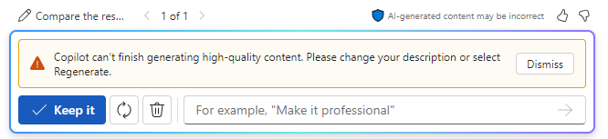

# Analyze resumes and make a recommendation using Microsoft 365 Copilot in Word
---
In the prior exercise, you learned how Microsoft 365 Copilot in Word can assist HR professionals in crafting a job description. In this exercise, you learn how it can automate the initial stages of the resume screening process. This functionality can help HR professionals quickly identify the most suitable candidates from large pools of applicants.

When you ask Copilot to generate a document or apply some type of change, it may sometimes start to display the draft and then stop. If this situation happens to you, select the **Regenerate** button to have it generate a new draft, or change your prompt and try again.

### Exercise

As the HR Manager at Graphic Design Institute, you started the hiring process for a new Senior Animation Designer. Your staff created a document that outlines all the job responsibilities for this role. In turn, you created a job description that you posted on the Web and on the company's internal employee website. You now want to use Microsoft 365 Copilot in Word to screen a batch of resumes that you received for the role and provide a recommendation as to which of the candidates qualifies for a job interview.

At the end of the prior exercise, you saved the job description file that you created. You were instructed to save the file as **Graphic Design Institute - Job descriptions.docx**. If you saved it as a different file name, then remember the name that you used so that you can locate the file in this exercise. In this exercise, perform the following steps to have Microsoft 365 Copilot in Word compare the four resumes that you received against this job description file to help determine which candidate is most qualified:

1.  Select the following links to download the resumes that you've received thus far:
     -  [Resume - Patti Fernandez](https://go.microsoft.com/fwlink/?linkid=2268829)
     -  [Resume - Nestor Wilke](https://go.microsoft.com/fwlink/?linkid=2268930)
     -  [Resume - Holly Dickson](https://go.microsoft.com/fwlink/?linkid=2268828)
     -  [Resume - Alex Wilber](https://go.microsoft.com/fwlink/?linkid=2269127)
2.  Once the downloads are complete, open **File Explorer** and copy the files from your **Downloads** folder to a folder in your OneDrive account.
3.  In this exercise, you access the documents from the Most Recently Used (MRU) file list. To get the files to appear in the MRU list, open each document and then close it. Open and close each of the four resume files in your OneDrive account.
4.  In **Microsoft 365**, open **Microsoft Word**, and then open a new blank document.
5.  In the **Draft with Copilot** window that appears at the top of the blank document, enter the following prompt, but don't submit the prompt just yet. You must attach the files to the prompt in the next step:
    
    **I'm the Hiring Manager for Graphic Design Institute. We're hiring for the position of Senior Animation Designer. Please create a report that compares the attached resumes to the requirements for a Senior Animation Designer in the attached job description file and rank the candidates from most qualified to least qualified. Thank you!**
6.  You now must attach to the prompt the **Graphic Design Institute - Job descriptions.docx** file that you saved to your OneDrive account at the end of the prior exercise. In the **Draft with Copilot** window, select the **Reference your content** button. In the drop-down menu that appears, if the job description file appears in the list of files, select it. Otherwise, select **Browse files from cloud**, locate the job description file that you saved to your OneDrive account in the prior exercise, and then select the **Attach** button. Note how the file is displayed in the prompt.
7.  Repeat the prior step for each of the four resumes that you downloaded. Note what happens when you attempt to attach the third resume. Copilot displays a message indicating that you can only include up to three files to a prompt. Since you had to include the job description file that provides Copilot with the job requirements, you can only submit two of the resumes with this initial prompt.
8.  Since you attached the job description file and the first two resumes to the prompt, select **Generate**. At this point, Copilot extracts the pertinent information from the job description file and the first two resumes and creates a Resume Comparison report. At this point, you're in Copilot draft mode.
9.  Review the results of this first draft.
    
    > **IMPORTANT:** Take a look at the **Draft with Copilot** window and note that it doesn't include an **Attach** button. Once you're in draft mode like you currently are, Copilot doesn't allow you to attach any more files to subsequent prompts. You can use the prompt field to modify the document, but you can no longer attach another file. Keep this requirement in mind as you proceed through the next steps. This current draft only compares the first two resumes. To compare the remaining two resumes to the two that are in the current draft, you must keep a draft of this report, and then create a second report that compares the two remaining resumes to the document that you just created.
    
  You're now looking at the first draft of the report that compares the first two resumes to the job description file. Copilot gives you the ability to regenerate however many drafts you want until you find one that you prefer. Even if you think this first draft looks okay, select the **Regenerate** button in the **Draft with Copilot** window to have Copilot create a second draft.

10. Review the second draft that Copilot created. In the real world, you can repeat this process until you're satisfied with a specific draft. If you want to go back to a previous draft to compare it to a more recent draft, select the forward (&gt;) and backward (&lt;) arrows to go back and forth through the drafts. Compare the two drafts that you created and make sure the one you prefer is displayed (it will either be **1 of 2** or **2 of 2**). When you find a draft that you want to use, select the **Keep it** button.
    
    > **NOTE:** When you select **Keep it**, Copilot moves from draft mode into normal Microsoft Word mode. It also automatically saves the **Report Comparison** document to your OneDrive account.
11. You're now ready to have Copilot review the final two resumes. However, as the earlier step indicated, you must compare the remaining two resumes to the **Report Comparison** document that you just created that compared the first two resumes. To do so, you must open a new Word document. Since you're still in the **Word** tab in your browser with the current **Report Comparison** document being displayed, select **File** in the menu above the **Word** ribbon, and then on the **Home** page, select **Blank document** under the **New** section. Doing so opens a new tab in your browser along with a new Word document.

12. In the **Draft with Copilot** window, enter the following prompt, but don't submit it. You must attach the remaining two resume files and the first **Report Comparison** report to the prompt in the next step:
    
    **That was a good start. Please create a report that compares the attached resumes to the prior resume comparison report (attached) and rank the candidates from most qualified to least qualified. Thank you!**
13. You now must attach the report that you just created that compared the first two resumes, along with the remaining two resumes. After entering the prompt in the prior step, select the **Reference your content** button in the **Draft with Copilot** window. In the drop-down menu that appears, the **Report Comparison of Resumes** document that you created should appear at the top of the file list. Select this document.
14. In the **Draft with Copilot** window, select the **Reference your content** button. In the drop-down menu that appears, you need to attach one of the remaining two resumes. If you see one of the files in the file list, then select it. Otherwise, select **Browse files from cloud**, locate one of the remaining two resumes (you should see it if you scroll through the **Recent** file list), select it, and then select the **Attach** button. Repeat this process to select the final remaining resume.
15. Once you have the first Report Comparison report and the remaining two resumes attached to the prompt, select the **Generate** button in the **Draft with Copilot** window.
16. Copilot should compare the first two resumes and the final two resumes and provide a rank list of the candidates. At this point, you could regenerate a new draft or ask Copilot to make any changes. For this training exercise, you decide you're satisfied with the report, so select the **Keep it** button.
17. At this point, Copilot generated two Report Comparison documents, the second of which is the final report comparing all four candidates. Keep this scenario in mind if you must do something similar in the real-world using Microsoft 365 Copilot in Word. You want to verify that you're using the correct document moving forward. You can close this tab in your Microsoft Edge browser.
